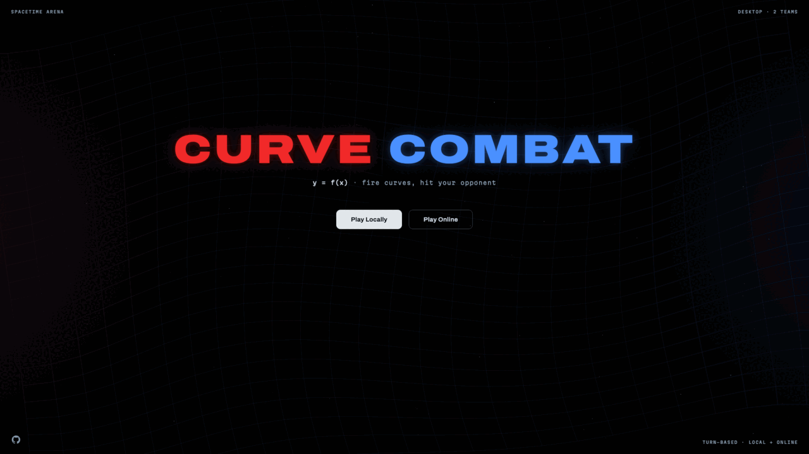

# CurveCombat

**Play: [curvecombat.sakongroup.work](https://curvecombat.sakongroup.work/)**

A browser game where you aim by writing a curve.



Two teams face off across a planet-scattered arena. On your turn you type a
mathematical function — `x^2/8`, `3sin(x/2)`, `e^(x/4)` — and fire. The curve is
drawn from your soldier outward, bends around (or slams into) the planets, and
either hits an enemy or doesn't. No preview: blind fire is the point. The
challenge is knowing your functions well enough to aim without seeing the shot
first.

Play **local hotseat** on one machine, or **online** — the host creates a room,
shares a 4-letter code, friends drop in as players or spectators (NvN, two
teams).

Desktop and tablet, either orientation. Phones are gated out.

## Quick start

```bash
npm install
npm run dev:all      # client on :5173 + game server on :3001
```

Open http://localhost:5173. For local hotseat only, `npm run dev` is enough —
the server is needed just for online rooms.

## How to play

1. **Landing** → *Play locally* or *Play online*.
2. **Pre-game** — tune the arena (map size, planet count, gravity, HP mode,
   rounds, turn timer) or just hit start. Online: share the room code or link.
3. **Your turn** — type a function of `x` in the footer and fire. The curve is
   anchored to your soldier: it always passes through you, so a constant fires a
   flat line at your own height, not at `y = c`.
4. Hit an enemy to score (Classic) or damage them (HP mode). Shots that leave the
   arena or hit a planet leave a crater.

On touch devices the in-app keypad is the only keyboard — the OS keyboard is
deliberately suppressed so the math field never loses its caret.

## Scripts

| Command | What it does |
| --- | --- |
| `npm run dev` | Vite client on port 5173 |
| `npm run server` | WebSocket game server on port 3001 |
| `npm run dev:all` | Both together |
| `npm test` | Vitest suite |
| `npm run build` | Typecheck (`tsc --noEmit`) + production build |
| `npm run preview` | Serve the production build |

## Configuration

| Variable | Where | Default | Purpose |
| --- | --- | --- | --- |
| `PORT` | server | `3001` | Port the WebSocket server listens on |
| `VITE_WS_URL` | client build | `ws://localhost:3001` | WebSocket endpoint the client dials |

To deploy, build the client (`npm run build` → `dist/`) with `VITE_WS_URL`
pointed at your server, and run `npm run server` behind a WebSocket-capable
reverse proxy.

## How it's built

React + TypeScript + Vite on the client, Pixi.js for the arena canvas, and an
authoritative WebSocket server for online play.

```
src/sim/     pure deterministic simulation — physics, collision, arena generation
src/math/    expression parsing and evaluation for the fired functions
src/game/    match orchestration — rounds, turns, HP, config
src/graph/   Pixi renderer — camera, arena, curves
src/net/     wire protocol (Zod) and the networked client
src/app/     React screens, arena stage, HUD
server/      rooms and the match engine (source of truth for online matches)
docs/        architecture decisions, specs, plans
```

`src/sim/` is Node-safe and seeded — the server and every client compute the same
result from the same inputs. The server is authoritative for online play: turns,
phase, and state come from it, and the client renders what it's told.

## Contributing

Tests are colocated (`*.test.ts(x)`, Vitest + Testing Library) and written first.
Note that the root `tsc` does not cover `server/` — after a server change also run
`npx tsc -p server/tsconfig.json`.

Much of the surface here is UI, animation, networking, and turn lifecycle; the
bugs that bite (focus, leaked timers, render timing, reconnect state) are ones the
unit suite misses. Verify in a real browser.

See [CLAUDE.md](CLAUDE.md) for conventions and gotchas, [CONTEXT.md](CONTEXT.md)
for the domain glossary, and [docs/adr/](docs/adr/) for accepted decisions.

## Acknowledgements

CurveCombat is inspired by [Graphwar](https://github.com/catabriga/graphwar) by Lucas
Catabriga Rocha — the game that had the idea of firing mathematical functions at your
friends first. CurveCombat is an independent reimplementation and shares no code with it.

## License

[GPL-3.0](LICENSE). Graphwar is likewise GPL-3.0.
